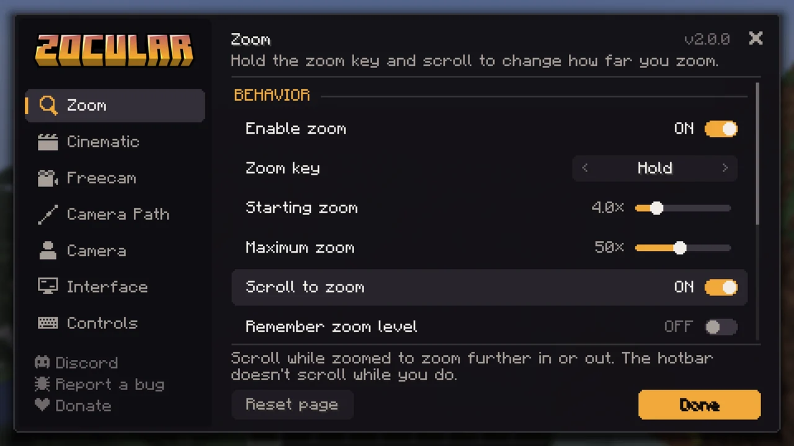

<div align="center">


Smooth zoom, a cinematic camera, freecam and camera paths for Minecraft.

[Modrinth](https://modrinth.com/mod/zocular) · [Report a bug](https://github.com/bossgaming8/zocular/issues) · [Discord](https://discord.gg/bananasandwich) · [bananasandwich.us](https://www.bananasandwich.us)

</div>

## Features

- **Zoom.** Hold <kbd>C</kbd> and scroll to go anywhere from 1.1× to 50×. Mouse speed follows the zoom so aim stays steady, with optional look smoothing.
- **Cinematic camera.** Press <kbd>I</kbd> and the camera flies out and directs the scene like a film, cutting between side, chase, front, roadside and wide shots, with letterbox bars and a vignette. <kbd>R</kbd> cuts to the next shot.
- **Freecam.** Press <kbd>F4</kbd> to fly the camera around while your character waits where you left it. Blocks stop the camera unless you enable noclip.
- **Camera paths.** In freecam, left-click to drop keyframes and right-click to play them back as one smooth shot along a spline.
- **Third person.** Camera distance, an over-the-shoulder view, and camera roll for freecam and cinematic shots.

All of it is configured from one settings screen: open it from Mod Menu, type `/zocular`, or bind a key to it. The HUD elements can be dragged anywhere with `/zocular hud`.



## Requirements

- Minecraft 26.3 with Fabric Loader 0.19.5 or newer
- [Fabric API](https://modrinth.com/mod/fabric-api)
- [Mod Menu](https://modrinth.com/mod/modmenu) is optional

Zocular is client-side only. Some servers don't allow freecam, so check their rules.

## Building

You need JDK 25.

```sh
./gradlew build
```

The jar is written to `build/libs`. `./gradlew runClientGameTest` starts the game and runs the client tests.

## License

Copyright © 2026 Bhored. All rights reserved. See [LICENSE](LICENSE).
